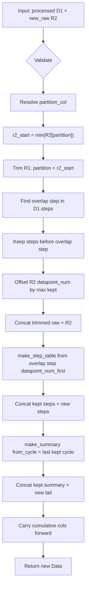

# Issue #86 plan — update data and merge tests

## Goal

Add first-class APIs on `Data` / `CellpyCellCore` to (1) **merge** two processed `Data` objects and (2) **incrementally update** one processed `Data` with new raw rows — without full re-summarization where the issue algorithm allows.

**Phase A (`merge_data`) — shipped** on branch `86-update-data-merge-tests` (pending `/iflow-close`).

**Phase B (`update_data`) — this plan** is the next PR on the same branch (or a follow-up branch after Phase A merges).

---

## Phase A recap (done)

Implemented in [`src/cellpycore/merge.py`](../../src/cellpycore/merge.py): `merge_data`, `CellpyCellCore.merge_core_data`, 11 tests. Defaults: `renumber_cycles=True`, `allow_duplicate_test_id` renumbers right.

---

## Phase B — `update_data`

### Goal

Append new raw rows to an **already processed** single-test `Data` object, trimming the overlap at the partition boundary and refreshing only the affected steps / cycle-summary tail.

### Constraints

- Same as Phase A (polars-native, schema-injected, inputs untouched, return new `Data`).
- **Single-test v1:** one `test_id` in existing data; `new_raw` must belong to the same test. Multi-test update → follow-up.
- Partition on **`source_datapoint_num`** (instrument-stable key per issue). Fallback to `datapoint_num` with `logger.warning` when absent.
- Reuse Phase A cumulative carry-forward (`_carry_forward_cumulative_summary`) for summary stitch.
- `ir_to_summary` / `c_rates_to_summary` **not** inside `update_data` — caller (or `update_core_data`) re-runs them if needed, mirroring `make_core_summary` split.

### Prior art

| Hit | Module | Notes |
|-----|--------|-------|
| `merge_data`, `_carry_forward_cumulative_summary` | `merge.py` | Cumulative stitch; frame copy helpers — **reuse** |
| `make_step_table(..., from_data_point=…)` | `summarizers.py` | Filters raw `>= from_data_point`, returns steps `DataFrame` without mutating `data` — **primary incremental step path** |
| `_dev_update_merge`, `_dev_update_make_steps`, `_dev_update_make_summary` | `cellpy/readers/cellreader.py` | Legacy WIP: drop last raw row, steps `[:-1]`, `from_data_point=last_step.point_first`; summary uses `from_cycle` but still full-recomputes today |
| `source_datapoint_num` | `config.RawCols`, `mock_data.py` | Partition key; mock data sets `source_datapoint_num == datapoint_num` |
| `make_summary` | `summarizers.py` | **No `from_cycle` yet** — needs new param or helper for tail-only summary |
| Toolbox / graph | — | No new tools; graphify confirms `make_step_table` ↔ `from_data_point` link |

### Approach

Add to [`src/cellpycore/merge.py`](../../src/cellpycore/merge.py) (or rename module to `data_ops.py` only if merge+update makes the name misleading — **keep `merge.py` for now**, KISS):

```python
def update_data(
    data: Data,
    new_raw: pl.DataFrame,
    *,
    schema: Schema | None = None,
    nom_cap: float = 1.0,
    partition_col: str | None = None,
    test_mode: TestMode = TestMode.NORMAL,
    **step_table_kwargs,
) -> Data:
    ...
```

Thin wrapper: `CellpyCellCore.update_core_data(...)`. Export from `__init__.py`.

#### Data flow



**Step-by-step**

1. **Validate:** `data.raw`, `data.steps`, `data.summary` populated; `new_raw` non-empty; required schema columns present; single `test_id` in existing frames.
2. **Partition column:** default `schema.raw.source_datapoint_num`; if missing from both frames, fall back to `datapoint_num` + warning.
3. **Overlap boundary:** `r2_start = new_raw[partition_col].min()`. If `r2_start < max(data.raw[partition_col])`, treat as in-progress overlap (issue default). If `r2_start` is strictly greater than max kept (gap), append without trim (no step truncation).
4. **Trim raw:** keep rows with `partition_col < r2_start`; drop rows `>= r2_start` from D1.
5. **Trim steps:** locate the step whose `[datapoint_num_first, datapoint_num_last]` bracket contains the first raw row at/after `r2_start` (match on `datapoint_num` after sorting raw). Drop that step and all later steps from kept steps. *(Mirrors issue: "that step and all after belong to R2".)*
6. **Align `datapoint_num` on `new_raw`:** offset by `max(kept.datapoint_num)` (same boundary rule as `merge_data` — first new row may share the boundary index).
7. **Append raw:** `pl.concat([kept_raw, new_raw])`.
8. **Incremental steps:** call `make_step_table(slice_data, from_data_point=overlap_step.datapoint_num_first, …)` on a temporary `Data` holding the **combined** raw; returns new-step rows only. Concat with kept steps.
9. **Incremental summary:** add `from_cycle: int | None = None` to `make_summary` (or private `_make_summary_from_cycle`):
   - Build summary rows only for cycles `>= from_cycle` using combined raw + combined steps.
   - Keep summary rows with `cycle_num < from_cycle` from D1 unchanged.
   - Apply `_carry_forward_cumulative_summary(kept_summary, new_tail, chdr)` so `test_cumulated_*` continues from the last kept row (reference cycle = last kept cycle, per issue).
10. **Return** fresh `Data`; do not mutate input.

#### Summarizer change (minimal)

Add to `make_summary`:

```python
def make_summary(..., from_cycle: int | None = None) -> Data:
```

When `from_cycle` is set, filter `steps` (and raw cycle-end selection) to `cycle_num >= from_cycle` before aggregation; return only the tail rows. `update_data` concatenates `kept_summary` + tail. Document that `from_cycle` is an incremental-update hook, not a public cellpy parity feature yet.

**Not** adding `from_data_point` changes — already sufficient.

#### Edge cases

| Case | Behavior |
|------|----------|
| `new_raw` empty | Return `_copy_data(data)` |
| No overlap (`r2_start > max kept partition`) | Append raw; full step/summary recompute from `from_cycle = last_cycle + 1` or last kept cycle |
| `r2_start` before any kept row | Replace entire dataset (equivalent to re-process from scratch) — warn |
| Missing steps/summary on input | `ValueError` with clear message |
| Multiple `test_id` in D1 | `ValueError` (v1) |

### Files to touch

| File | Change |
|------|--------|
| [`src/cellpycore/merge.py`](../../src/cellpycore/merge.py) | `update_data` + private overlap/trim helpers |
| [`src/cellpycore/summarizers.py`](../../src/cellpycore/summarizers.py) | `make_summary(..., from_cycle=None)` tail path |
| [`src/cellpycore/cell_core.py`](../../src/cellpycore/cell_core.py) | `update_core_data` delegate |
| [`src/cellpycore/__init__.py`](../../src/cellpycore/__init__.py) | Export `update_data` |
| [`tests/test_merge.py`](../../tests/test_merge.py) or `tests/test_update.py` | Phase B tests (prefer extend `test_merge.py` or split if >~200 lines) |

### Test strategy

```bash
uv run pytest tests/test_merge.py tests/test_update.py -v   # if split
uv run pytest                                              # full suite
```

**Oracle pattern:** for synthetic fixture, `full = process(concat(trim(R1), R2))` vs `update(process(R1), R2)` — steps and summary must match (within float tolerance).

**Cases**

- Single-row overlap at boundary (`source_datapoint_num` shared).
- Multi-row overlap (several raw rows re-sent).
- Gap append (no overlap — new partition values all greater than max kept).
- Fallback when `source_datapoint_num` absent (uses `datapoint_num`, warning logged).
- Input immutability.
- `update_core_data` on `CellpyCellCore`.
- Missing steps/summary → `ValueError`.

### Scope check

Phase B is one focused PR (~200–350 lines). No refactor of `merge.py` module rename. No multi-test update. No metadata / `TestMetaCollection` wiring.

---

## Resolved (Phase A)

1. Phase A first — **yes, done**.
2. `renumber_cycles` default — **`True`**.
3. `allow_duplicate_test_id` — **auto-renumber right**.
4. Branch — **`86-update-data-merge-tests`**.

## Open questions (Phase B — confirm before `/iflow-start`)

1. **Same branch vs new:** Continue on `86-update-data-merge-tests` after Phase A closes, or new branch `86-update-data`? *(Recommend: same branch if Phase A not merged yet; else `86-update-data` off main.)*
2. **Gap append:** When `r2_start > max(partition)`, recompute steps for **all** new raw only, or from last cycle? *(Recommend: steps from overlap `from_data_point` = first new row's `datapoint_num`; summary `from_cycle = max kept cycle`.)*
3. **Full replace:** When `r2_start <= min(partition)`, raise vs silently replace? *(Recommend: raise `ValueError` — caller should use fresh `from_raw_frame`.)*
4. **`update_core_data` extras:** Should wrapper optionally re-run `ir_to_summary` + `c_rates_to_summary` like `make_core_summary`? *(Recommend: yes, behind `refresh_derived: bool = True` default.)*
