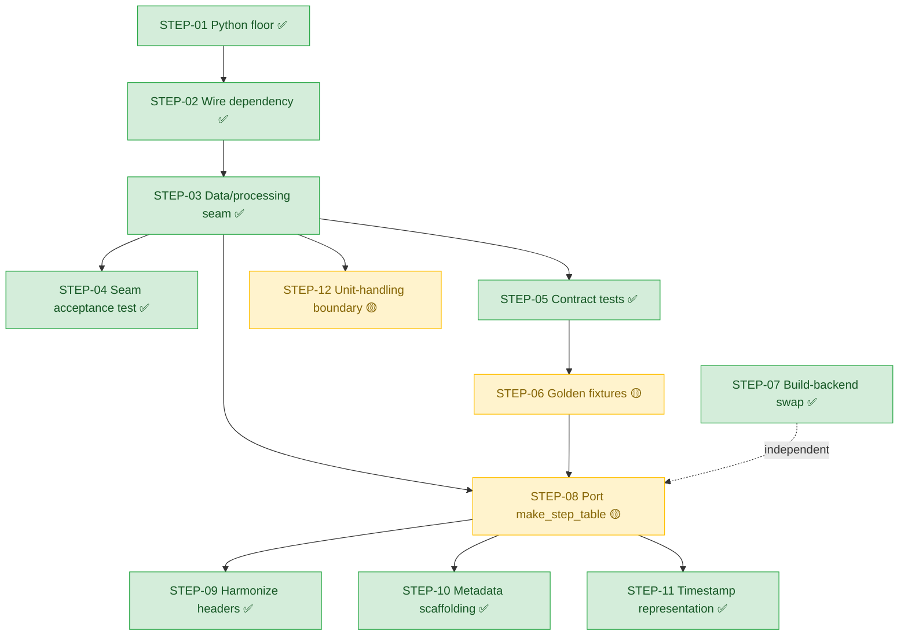

# cellpy-core integration roadmap — step-by-step issues toward the goal

This document is the **roadmap**: it breaks the cellpy ⇄ cellpy-core integration into a
sequence of small, individually-shippable steps, each of which becomes (one or more)
GitHub issues. It is the planning layer that sits **on top of** the strategy and
practical guides:

- [`cellpy-core-migration.md`](cellpy-core-migration.md) — the practical companion: local
  dev wiring (uv path source), parity tests, and the metadata boundary.
- [`cellpy-core-integration-into-cellpy.md`](cellpy-core-integration-into-cellpy.md) — the
  strategy/findings: the seam design, branch-334 decision, and recommended sequencing.

## What we want

The end goal is for the large, mature **`cellpy`** library to delegate its core
processing — finding steps and cycles, and building the per-step / per-cycle tables — to
the small, fast **`cellpy-core`** library, **without** silently breaking the existing
`cellpy` behaviour and **without** requiring a PyPI release of core during development.

We get there by *branching, not forking*: integration work lands on branches of the real
repos, wired together for local dev via an editable `uv` path source, with parity
enforced by tests (legacy header/unit contract tests + golden parquet fixtures) rather
than by vigilance. We start at the **`OldCellpyCellCore`** legacy bridge so `cellpy` keeps
seeing the headers/units it already expects, then progressively move more of the core
engine (e.g. `make_step_table` + `CellpyLimits`) into `cellpy-core`.

The chapters below outline the steps in the intended order. Each step is deliberately
**thin for now** — a short description and its tracking anchors. We will flesh them out
together, one at a time, before implementation.

## Status at a glance

Reconciled against the actual repo state on **2026-06-26**. Status legend: ✅ done ·
🟡 partly done / in progress · ⬜ not started.

| Step | Status | Evidence / what remains |
|------|--------|-------------------------|
| STEP-01 Python floor | ✅ done | both repos pin `requires-python = ">=3.13"` |
| STEP-02 Wire dependency | ✅ done | git ref + `[tool.uv.sources]` editable path in `cellpy/pyproject.toml` |
| STEP-03 Data/processing seam | ✅ done | `self.core = OldCellpyCellCore(...)`; `data` reads `core._data`; summary + step table routed (`cellreader.py`) |
| STEP-04 Seam acceptance test | ✅ done | `cellpy/tests/test_slim.py` |
| STEP-05 Contract tests | ✅ done | `cellpy/tests/test_core_settings_parity.py` (`CellpyLimits` excluded — see STEP-08) |
| STEP-06 Golden fixtures | 🟡 ongoing | `cellpy-core/tests/test_golden.py` in place; extend as more is ported |
| STEP-07 Build-backend swap | ✅ done | `cellpy` already hatchling+uv; no `setup.py` |
| STEP-08 Port `make_step_table` | 🟡 largely done | ported + routed; remaining: add `CellpyLimits` to the parity test, retire any dead step-table code in `cellpy` |
| STEP-09 Harmonize headers | ✅ done | `config.Cols` + spec tests; `header_mapping.py` gives lossless/total `config.Cols` ↔ legacy `Headers*` round-trip (`tests/test_header_mapping.py`) (#34/#35) |
| STEP-10 Metadata scaffolding | ✅ done | `cellpycore.metadata` (`models.py`/`io.py`); `TestMeta`/`CellMeta`/`TestMetaCollection` + (de)serialize/merge; graceful-degradation guard (`tests/test_metadata.py`) (#37) |
| STEP-11 Timestamp representation | ✅ done | `epoch_time_utc` + `first/last_epoch_time_utc` are int64-ns UTC; `cellpycore.timestamps` conversion helpers + fixture regenerated (`tests/test_timestamps.py`) (#32, PR #38) |
| STEP-12 Unit-handling boundary | 🟡 partly done | `CellpyUnits` schema + `units.py` tooling behind the optional `units` extra; factors cross the seam by value; `cellpy` still keeps duplicate converters |

Per-step `Status:` lines below repeat this for context; this table is the quick reference.

## STEP-01 Resolve the Python floor

**Status:** ✅ done — both repos pin `requires-python = ">=3.13"`.

**Codebase:** `cellpy` and `cellpy-core` (one or both `pyproject.toml`).

Align the supported Python versions across both repos so the dependency can be wired
without friction. Resolved: both `cellpy` and `cellpy-core` now pin
`requires-python = ">=3.13"`. Kept here for completeness and as the explicit prerequisite.

**Tests (success criteria):**
- CI matrix runs (and is green) on the agreed Python floor in both repos.
- A trivial import/smoke test passes under the chosen interpreter in each repo.

## STEP-02 Wire the dependency (git reference + editable uv path source)

**Status:** ✅ done — git reference + `[tool.uv.sources]` editable path both present in
`cellpy/pyproject.toml`.

**Codebase:** `cellpy` (`pyproject.toml`).

Make `cellpy` consume `cellpy-core`: the `git+https…@<ref>` reference as the
release/consumer truth, plus a local `[tool.uv.sources]` editable path to `../cellpy-core`
for day-to-day development.

**Tests (success criteria):**
- `uv sync` / lock resolves cleanly with `cellpycore` present.
- A smoke test in `cellpy` imports `cellpycore` and reads its version.
- Editable-path sanity: an edit in `../cellpy-core` is visible from the `cellpy` env
  without reinstall (can be a manual check or a tiny CI step).

## STEP-03 Land the Data/processing seam on `OldCellpyCellCore`

**Status:** ✅ done — `CellpyCell` constructs `self.core = OldCellpyCellCore(...)`, the
`data` property reads/writes `core._data`, and `make_summary` (plus the step table) is
routed through the core (`cellreader.py`). Note: the step table is *already* routed too,
ahead of this step's original "leave it for now" framing.

**Codebase:** `cellpy` (`readers/cellreader.py`).

The first real integration PR in `cellpy`: construct `self.core = OldCellpyCellCore(...)`,
move `Data` ownership into core, and route `make_summary` (and the newer `add_to_summary`
/ cycle-selection methods) through the core. Leave `make_step_table` in `cellreader.py`
for now.

**Tests (success criteria):**
- `cpi.core` is an `OldCellpyCellCore` and the legacy headers/units are restored
  (verified in `cellpy/tests/test_slim.py::test_core_seam_wired` — exists).
- `cpi.data is cpi.core._data` and assignment writes through the seam
  (`test_data_ownership_in_core` — exists).
- The **full existing `cellpy` suite stays green** (regression guard that the seam is
  behaviour-preserving).

## STEP-04 Add the seam's acceptance test

**Status:** ✅ done — `cellpy/tests/test_slim.py` exists with real assertions.

**Codebase:** `cellpy` (`tests/`).

Port `tests/test_slim.py` (from branch 334) as the acceptance test for the seam and keep
the full `cellpy` suite green.

**Tests (success criteria):** this step *is* a test deliverable. `cellpy/tests/test_slim.py`
(exists) should cover:
- end-to-end `from_raw` → `make_summary` through the core, asserting the calculated
  summary columns are present and the golden `data_point == 1457` at cycle 1
  (`test_make_summary_through_core`);
- the load/save round-trip still works across the seam (`test_make_summary_save_roundtrip`);
- the core can build a summary directly from a loaded `Data`
  (`test_direct_core_make_core_summary`).

## STEP-05 Add header/unit contract tests

**Status:** ✅ done — `cellpy/tests/test_core_settings_parity.py` asserts field-by-field
parity for `HeadersNormal` / `HeadersSummary` / `HeadersStepTable` / `CellpyUnits`.
`CellpyLimits` is intentionally excluded there for now (fold it in under STEP-08).

**Codebase:** `cellpy` (`tests/`, asserting against `cellpycore.legacy`).

Assert that `cellpycore.legacy` (`HeadersNormal` / `HeadersSummary` / `HeadersStepTable` /
`CellpyUnits`) equals `cellpy.parameters.internal_settings` field-by-field, so the
duplicated copies cannot silently drift.

**Tests (success criteria):**
- Field-by-field equality test (one per class) comparing each `cellpycore.legacy`
  settings object to its `cellpy.parameters.internal_settings` counterpart, covering
  both keys and values — fails loudly on any drift.
- Include `CellpyUnits` (incl. `resistance == "ohm"`) so unit drift is caught too.

## STEP-06 Extend the golden-fixture parity oracle

**Status:** 🟡 ongoing — `cellpy-core/tests/test_golden.py` is in place (step/cycle goldens
+ cross-repo step-type parity + frame snapshots). Keep extending as more is ported.

**Codebase:** `cellpy-core` (`tests/`, `tests/data/`).

Grow the cross-library golden parquet fixtures so each newly-ported piece of the core is
checked against `cellpy`'s published goldens.

**Tests (success criteria):** extend `cellpy-core/tests/test_golden.py` (exists), which
already pins:
- step/cycle goldens on real Arbin data (103 steps / 18 cycles / cycle-1 `data_point`
  1457);
- the step-type classification against cellpy's own committed `steps.csv` (true cross-repo
  parity);
- frame-level snapshots of the step table and summary.
Add fixtures + assertions for each new behaviour as it is ported (regenerated
intentionally via `dev/regenerate_test_data.py`).

## STEP-07 Build-backend swap (independent)

**Status:** ✅ done — `cellpy/pyproject.toml` already uses `hatchling.build` (+ uv) and
there is no `setup.py`.

**Codebase:** `cellpy` (`pyproject.toml`, `setup.py`).

Move `cellpy` from setuptools+`requirements.txt`+`setup.py` to hatchling+uv for tooling
parity. Independent of the integration; translate `package_data`, `entry_points`, and
`extras_require` faithfully.

**Tests (success criteria):**
- A build smoke check (CI): `uv build` produces a wheel + sdist without error.
- Packaging-contract test: the built/installed package still exposes the expected
  `entry_points` (console scripts) and bundles the declared `package_data`.
- Each former `extras_require` extra resolves/installs under the new config.
- The full `cellpy` suite stays green against the freshly-built package.

## STEP-08 Port `make_step_table` (+ `CellpyLimits`) into core

**Status:** 🟡 largely done — `summarizers.make_step_table` + `make_core_step_table` are
implemented and `cellpy.make_step_table` already delegates across the seam; `CellpyLimits`
lives in `cellpycore.legacy` (`tests/test_limits.py`). Remaining: add `CellpyLimits` to
the STEP-05 parity test, and retire any dead step-table code left in `cellpy`.

**Codebase:** `cellpy-core` (primary); follow-up cleanup in `cellpy`.

Bring the remaining half of the core engine into `cellpy-core`, including the step-type
detection thresholds (`CellpyLimits`).

**Tests (success criteria):**
- `CellpyLimits` parity + behaviour: values match the legacy thresholds, dict-like access
  works, and the default raw limits derive from it (`cellpy-core/tests/test_limits.py` —
  exists).
- Step-table parity on real data: counts, per-cycle datapoints, step-type classification,
  and frame snapshot all match the goldens (STEP-06 oracle in `test_golden.py`).
- After removing the old `make_step_table` from `cellpy`'s `cellreader.py`, `cellpy`'s
  step-table tests stay green by routing through the core.

## STEP-09 Harmonize column headers

**Status:** ✅ done — `config.Cols` (`RawCols` / `StepCols` / `CycleCols`) and their
spec-conformance tests exist, and `header_mapping.py` now centralizes a lossless, total
`config.Cols` ↔ legacy `Headers*` round-trip, covered by `tests/test_header_mapping.py`
(#34/#35).

**Codebase:** `cellpy-core` (`config` / `legacy`).

Settle the column-header story (`config.Cols` ↔ legacy `Headers*`).

**Tests (success criteria):**
- Spec-conformance tests pin `RawCols` / `StepCols` / `CycleCols` to the authoritative
  spec tables (`cellpy-core/tests/test_config_columns.py` — exists).
- A round-trip / mapping test proving `config.Cols` ↔ legacy `Headers*` translation is
  lossless and total (every legacy header maps and back).
- The STEP-05 contract tests and STEP-06 goldens still pass (no silent rename drift).

## STEP-10 Metadata scaffolding in core (population stays opt-in upstream)

**Status:** ✅ done — `cellpycore.metadata` ships the scaffolding: `models.py`
(`CellMeta` / `TestMeta` / `TestMetaCollection`, keyed by `test_id`) and `io.py`
((de)serialize, `merge_test_meta`, plus `NotImplementedError` HDF5/DB stubs). The
step/summary engine is untouched and a graceful-degradation guard proves core never
*requires* populated metadata (`tests/test_metadata.py`). Population stays the consumer's
opt-in (#37).

**Codebase:** `cellpy-core` (scaffolding); population is `cellpy`'s opt-in later.

Let core own the metadata *scaffolding and tooling* — `TestMeta`/`CellMeta` schema,
`test_id` plumbing, (de)serialization/merge/conversion helpers — while keeping populated
metadata off the hot path and out of core's required `Data` shape. Attaching real metadata
remains the consumer's (cellpy v2.0) opt-in.

**Tests (success criteria):**
- Schema/dataclass round-trip: (de)serialization preserves all fields; merge helpers
  behave as specified; `test_id` grouping keys plumb through correctly.
- **Graceful-degradation guard (critical):** the step/summary engine runs unchanged with
  metadata absent/empty/mock — proving core never *requires* populated metadata.
- Goldens (STEP-06) are unchanged whether metadata is attached or not.

## STEP-11 Settle timestamp representation

**Status:** ✅ done — `epoch_time_utc` (raw) and `first/last_epoch_time_utc` (cycle) are
now **int64 nanoseconds since the Unix epoch, UTC**. `cellpycore.timestamps` provides the
ns ↔ float-seconds and ns ↔ datetime conversion helpers; the converter
(`dev/make_harmonized_raw.py`) and mock helper emit int64 ns and the harmonized parquet
fixture was regenerated. Covered by `tests/test_timestamps.py` and the updated
`test_harmonized_fixture.py` (#32, PR #38).

**Codebase:** `cellpy-core`.

Adopt the internal int64-ns timestamp representation.

**Tests (success criteria):**
- Conversion round-trip: float-seconds ↔ int64-ns with no precision loss across the
  fixture's time range (extends the `epoch_time_utc` checks in
  `cellpy-core/tests/test_harmonized_fixture.py`).
- Goldens (STEP-06) remain byte-identical after the representation change (no behavioural
  drift in derived step/cycle timing columns).

## STEP-12 Unit-handling boundary (scaffolding/tooling in core; population & policy upstream)

**Status:** 🟡 partly done — the `CellpyUnits` schema (`cellpycore.legacy`) and the
pint-based conversion tooling (`cellpycore.units`: `get_converter_to_specific`,
`nominal_capacity_as_absolute`, `Q`, output-unit defaults) already exist behind the
optional `units` extra, attached to the `OldCellpyCellCore` bridge, and conversion factors
already cross the seam **by value**. Remaining: `cellpy` still keeps its own duplicate
converter functions (not delegated to core), and the schema lives in `legacy.py` rather
than a dedicated unit-spec module.

**Codebase:** `cellpy-core` (scaffolding/tooling — `legacy.py` + `units.py`); population
(`raw_units` from loaders) and the decision to delegate are `cellpy`'s opt-in.

This is the **units analogue of the metadata boundary (STEP-10)**. Core owns the unit
*scaffolding and tooling* — the `CellpyUnits` schema and the pint conversion helpers — kept
off the hot path (lazy pint import via the `units` extra; the step/summary engine takes
float conversion factors by value, never unit objects). The consumer owns *population and
policy*: instrument loaders fill `data.raw_units`, and `cellpy` decides output-unit policy.
The opt-in upstream move is for `cellpy` to delegate its duplicated
`get_converter_to_specific` / `nominal_capacity_as_absolute` to `cellpycore.units` (as it
already did for headers and the step engine), and optionally to promote `CellpyUnits` out
of `legacy.py` into a first-class core unit-spec module.

**Tests (success criteria):**
- `CellpyUnits` field parity is already guarded by the STEP-05 contract test (included in
  its `SHARED_CLASSES`).
- Converter parity: assert `cellpycore.units.get_converter_to_specific` /
  `nominal_capacity_as_absolute` reproduce `cellpy`'s legacy converter outputs on fixture
  data (gravimetric / areal / absolute), so the duplicates can be retired without drift.
- **Optional-extra guard (critical):** importing `cellpycore` and running the step/summary
  engine works with pint **not installed**; the helpers raise a clear `ModuleNotFoundError`
  only when actually called.
- Goldens (STEP-06) are unchanged whether converters are resolved upstream or delegated to
  core.

## Implementation Flow

> Placeholder for the visual flow of the roadmap. We will fill this in together with one
> or more mermaid diagrams (e.g. step dependency graph, the two-repo branch/dev-wiring
> setup, and the parity-test feedback loop).

Node labels carry the reconciled status (✅ done · 🟡 partly · ⬜ not started).

