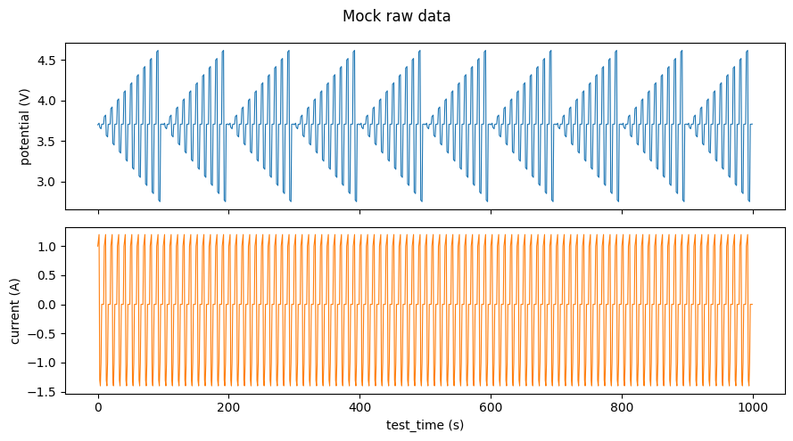
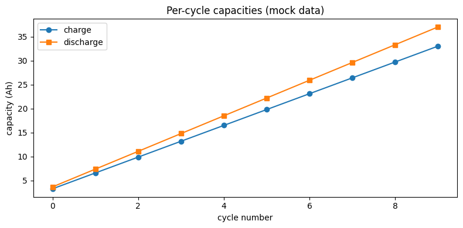

# Quickstart on mock data

This notebook runs the whole cellpy-core pipeline — `Data.from_raw_frame` →
`make_step_table` → `make_summary` — on synthetic data, so it works anywhere
the `cellpycore` package is installed (no cycler files needed).

The mock frame comes from `cellpycore.testing.mock_data.create_raw_data`,
which produces 1000 rows of charge / discharge / rest steps in the
[harmonized raw schema](../specifications/harmonized-raw.md).


```python
import matplotlib.pyplot as plt

import cellpycore
from cellpycore import Data, make_step_table, make_summary
from cellpycore.testing.mock_data import create_raw_data

print(f"cellpycore version: {cellpycore.__version__}")
```

    cellpycore version: 0.1.3


## 1. Create a raw frame

A raw frame is an ordinary polars `DataFrame` whose columns follow the
harmonized raw schema (`cellpycore.config.RawCols`).


```python
raw = create_raw_data()
raw.select(
    "test_time", "cycle_num", "step_num", "step_type", "current", "potential"
).head()
```


<div><style>
.dataframe > thead > tr,
.dataframe > tbody > tr {
  text-align: right;
  white-space: pre-wrap;
}
</style>
<small>shape: (5, 6)</small><table border="1" class="dataframe"><thead><tr><th>test_time</th><th>cycle_num</th><th>step_num</th><th>step_type</th><th>current</th><th>potential</th></tr><tr><td>f64</td><td>i64</td><td>i64</td><td>str</td><td>f64</td><td>f64</td></tr></thead><tbody><tr><td>0.0</td><td>0</td><td>0</td><td>&quot;charge&quot;</td><td>1.0</td><td>3.7</td></tr><tr><td>1.0</td><td>0</td><td>0</td><td>&quot;charge&quot;</td><td>1.1</td><td>3.71</td></tr><tr><td>2.0</td><td>0</td><td>0</td><td>&quot;charge&quot;</td><td>1.2</td><td>3.72</td></tr><tr><td>3.0</td><td>0</td><td>0</td><td>&quot;discharge&quot;</td><td>-1.3</td><td>3.67</td></tr><tr><td>4.0</td><td>0</td><td>0</td><td>&quot;discharge&quot;</td><td>-1.4</td><td>3.66</td></tr></tbody></table></div>


```python
fig, (ax1, ax2) = plt.subplots(2, 1, figsize=(9, 5), sharex=True)
ax1.plot(raw["test_time"], raw["potential"], lw=0.8)
ax1.set_ylabel("potential (V)")
ax2.plot(raw["test_time"], raw["current"], lw=0.8, color="tab:orange")
ax2.set_ylabel("current (A)")
ax2.set_xlabel("test_time (s)")
fig.suptitle("Mock raw data")
fig.tight_layout()
```


    

    


## 2. Run the pipeline

`Data.from_raw_frame` is the validating front door: it checks that the frame
carries the load-bearing columns with sane dtypes and reports every problem in
a single error. Then the step table must be built **before** the summary,
because `make_summary` reads `data.steps`.


```python
data = Data.from_raw_frame(raw)
make_step_table(data)  # optional C-rate: add_step_c_rate(data, nom_cap=...)
make_summary(data)

print(f"steps:   {data.steps.height} rows")
print(f"summary: {data.summary.height} cycles")
```

    steps:   100 rows
    summary: 10 cycles


## 3. Inspect the step table

One row per sequential step, with per-step statistics (first / last / min /
max / mean of current, potential, capacities …) and the classified
`step_type`.


```python
data.steps.select(
    "cycle_num",
    "step_num",
    "step_type",
    "current_mean",
    "potential_first",
    "potential_last",
    "charge_capacity_last",
    "discharge_capacity_last",
).head(8)
```


<div><style>
.dataframe > thead > tr,
.dataframe > tbody > tr {
  text-align: right;
  white-space: pre-wrap;
}
</style>
<small>shape: (8, 8)</small><table border="1" class="dataframe"><thead><tr><th>cycle_num</th><th>step_num</th><th>step_type</th><th>current_mean</th><th>potential_first</th><th>potential_last</th><th>charge_capacity_last</th><th>discharge_capacity_last</th></tr><tr><td>i64</td><td>i64</td><td>str</td><td>f64</td><td>f64</td><td>f64</td><td>f64</td><td>f64</td></tr></thead><tbody><tr><td>0</td><td>0</td><td>&quot;cv_discharge&quot;</td><td>-0.04</td><td>3.7</td><td>3.709</td><td>0.33</td><td>0.37</td></tr><tr><td>0</td><td>1</td><td>&quot;discharge&quot;</td><td>-0.04</td><td>3.8</td><td>3.709</td><td>0.66</td><td>0.74</td></tr><tr><td>0</td><td>2</td><td>&quot;discharge&quot;</td><td>-0.04</td><td>3.9</td><td>3.709</td><td>0.99</td><td>1.11</td></tr><tr><td>0</td><td>3</td><td>&quot;discharge&quot;</td><td>-0.04</td><td>4.0</td><td>3.709</td><td>1.32</td><td>1.48</td></tr><tr><td>0</td><td>4</td><td>&quot;discharge&quot;</td><td>-0.04</td><td>4.1</td><td>3.709</td><td>1.65</td><td>1.85</td></tr><tr><td>0</td><td>5</td><td>&quot;discharge&quot;</td><td>-0.04</td><td>4.2</td><td>3.709</td><td>1.98</td><td>2.22</td></tr><tr><td>0</td><td>6</td><td>&quot;discharge&quot;</td><td>-0.04</td><td>4.3</td><td>3.709</td><td>2.31</td><td>2.59</td></tr><tr><td>0</td><td>7</td><td>&quot;discharge&quot;</td><td>-0.04</td><td>4.4</td><td>3.709</td><td>2.64</td><td>2.96</td></tr></tbody></table></div>


## 4. Inspect the per-cycle summary

One row per cycle: capacities, coulombic efficiency, durations, and
per-direction current / potential statistics.


```python
data.summary.select(
    "cycle_num",
    "charge_capacity",
    "discharge_capacity",
    "coulombic_efficiency",
    "last_test_time",
)
```


<div><style>
.dataframe > thead > tr,
.dataframe > tbody > tr {
  text-align: right;
  white-space: pre-wrap;
}
</style>
<small>shape: (10, 5)</small><table border="1" class="dataframe"><thead><tr><th>cycle_num</th><th>charge_capacity</th><th>discharge_capacity</th><th>coulombic_efficiency</th><th>last_test_time</th></tr><tr><td>i64</td><td>f64</td><td>f64</td><td>f64</td><td>f64</td></tr></thead><tbody><tr><td>0</td><td>3.3</td><td>3.7</td><td>112.121212</td><td>99.0</td></tr><tr><td>1</td><td>6.6</td><td>7.4</td><td>112.121212</td><td>199.0</td></tr><tr><td>2</td><td>9.9</td><td>11.1</td><td>112.121212</td><td>299.0</td></tr><tr><td>3</td><td>13.2</td><td>14.8</td><td>112.121212</td><td>399.0</td></tr><tr><td>4</td><td>16.5</td><td>18.5</td><td>112.121212</td><td>499.0</td></tr><tr><td>5</td><td>19.8</td><td>22.2</td><td>112.121212</td><td>599.0</td></tr><tr><td>6</td><td>23.1</td><td>25.9</td><td>112.121212</td><td>699.0</td></tr><tr><td>7</td><td>26.4</td><td>29.6</td><td>112.121212</td><td>799.0</td></tr><tr><td>8</td><td>29.7</td><td>33.3</td><td>112.121212</td><td>899.0</td></tr><tr><td>9</td><td>33.0</td><td>37.0</td><td>112.121212</td><td>999.0</td></tr></tbody></table></div>


```python
summary = data.summary
fig, ax = plt.subplots(figsize=(8, 4))
ax.plot(summary["cycle_num"], summary["charge_capacity"], "o-", label="charge")
ax.plot(summary["cycle_num"], summary["discharge_capacity"], "s-", label="discharge")
ax.set_xlabel("cycle number")
ax.set_ylabel("capacity (Ah)")
ax.set_title("Per-cycle capacities (mock data)")
ax.legend()
fig.tight_layout()
```


    

    


## Next steps

- The [real cycling data walkthrough](real_data_walkthrough.md) runs the same
  pipeline on genuine instrument data via the `CellpyCellCore` class, adding
  C-rates and half-cell cycle modes.
- The [standalone-use guide](../user-guide/standalone-use.md) documents the
  full contract the caller must honor.
