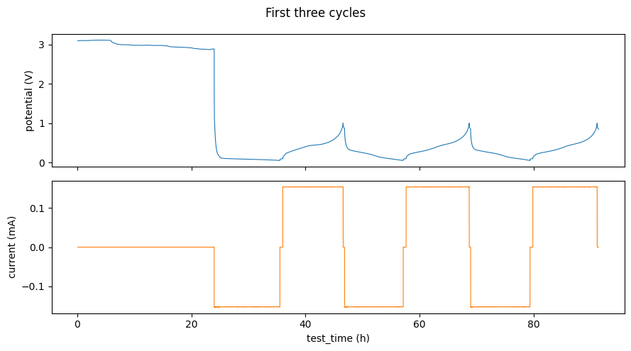
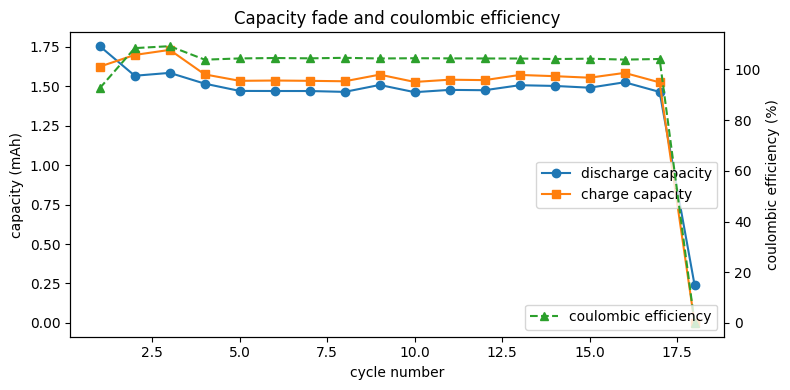

# Real cycling data walkthrough

This notebook processes genuine battery-cycling data: the small vendored test
fixture `tests/data/cycler_cc_harmonized_raw.parquet` (10 261 rows, 18 cycles
of constant-current cycling, originally recorded at IFE, Norway). It uses the
`CellpyCellCore` class, which orchestrates the engine and adds C-rates and
half-cell cycle modes on top of the plain
[quickstart](quickstart.md) pipeline.

Run it from a checkout of the repository so the fixture path resolves.


```python
from pathlib import Path

import matplotlib.pyplot as plt
import polars as pl

from cellpycore import CellpyCellCore, Data

FIXTURE = Path("../../tests/data/cycler_cc_harmonized_raw.parquet").resolve()
raw = pl.read_parquet(FIXTURE)
print(f"{raw.height} rows, {raw.width} columns")
```

    10261 rows, 29 columns


## 1. A first look at the raw data

The frame is already in the
[harmonized raw schema](../specifications/harmonized-raw.md): `potential` in
volts, `current` in amperes, times in seconds, capacities cumulative per
cycle and direction.


```python
raw.select(
    "datapoint_num",
    "test_time",
    "cycle_num",
    "step_num",
    "current",
    "potential",
    "cumulative_charge_capacity",
).head()
```


<div><style>
.dataframe > thead > tr,
.dataframe > tbody > tr {
  text-align: right;
  white-space: pre-wrap;
}
</style>
<small>shape: (5, 7)</small><table border="1" class="dataframe"><thead><tr><th>datapoint_num</th><th>test_time</th><th>cycle_num</th><th>step_num</th><th>current</th><th>potential</th><th>cumulative_charge_capacity</th></tr><tr><td>i64</td><td>f64</td><td>i64</td><td>i64</td><td>f64</td><td>f64</td><td>f64</td></tr></thead><tbody><tr><td>1</td><td>300.010482</td><td>1</td><td>1</td><td>0.0</td><td>3.097617</td><td>0.0</td></tr><tr><td>2</td><td>600.014947</td><td>1</td><td>1</td><td>0.0</td><td>3.10008</td><td>0.0</td></tr><tr><td>3</td><td>900.026371</td><td>1</td><td>1</td><td>0.0</td><td>3.101312</td><td>0.0</td></tr><tr><td>4</td><td>1200.039773</td><td>1</td><td>1</td><td>0.0</td><td>3.102852</td><td>0.0</td></tr><tr><td>5</td><td>1500.051275</td><td>1</td><td>1</td><td>0.0</td><td>3.10316</td><td>0.0</td></tr></tbody></table></div>


```python
first_cycles = raw.filter(pl.col("cycle_num") <= 3)
fig, (ax1, ax2) = plt.subplots(2, 1, figsize=(9, 5), sharex=True)
ax1.plot(first_cycles["test_time"] / 3600, first_cycles["potential"], lw=0.8)
ax1.set_ylabel("potential (V)")
ax2.plot(
    first_cycles["test_time"] / 3600,
    first_cycles["current"] * 1000,
    lw=0.8,
    color="tab:orange",
)
ax2.set_ylabel("current (mA)")
ax2.set_xlabel("test_time (h)")
fig.suptitle("First three cycles")
fig.tight_layout()
```


    

    


## 2. Process with `CellpyCellCore`

The class handles the `cycle_mode` string for you. This cell is an **anode
half-cell**, so coulombic efficiency is computed in the inverted direction
(`CE = 100 * charge / discharge`). `make_core_step_table` also estimates a
per-step C-rate from `nom_cap_abs` (absolute, in the same unit as
capacity — pass your cell's real value).


```python
NOM_CAP = 0.001  # Ah — nominal capacity of this small test cell

core = CellpyCellCore()
core.data = Data.from_raw_frame(raw)
core.cycle_mode = "anode"

data = core.make_core_step_table(core.data, nom_cap_abs=NOM_CAP)
data = core.make_core_summary(data, current_conversion_factor=1.0)

print(f"steps:   {data.steps.height} rows")
print(f"summary: {data.summary.height} cycles")
```

    steps:   103 rows
    summary: 18 cycles


## 3. The step table

One row per sequential step with per-step statistics, the classified
`step_type`, and the estimated C-rate.


```python
data.steps.select(
    "cycle_num",
    "step_num",
    "step_type",
    "c_rate",
    "current_mean",
    "potential_first",
    "potential_last",
).head(8)
```


<div><style>
.dataframe > thead > tr,
.dataframe > tbody > tr {
  text-align: right;
  white-space: pre-wrap;
}
</style>
<small>shape: (8, 7)</small><table border="1" class="dataframe"><thead><tr><th>cycle_num</th><th>step_num</th><th>step_type</th><th>c_rate</th><th>current_mean</th><th>potential_first</th><th>potential_last</th></tr><tr><td>i64</td><td>i64</td><td>str</td><td>f64</td><td>f64</td><td>f64</td><td>f64</td></tr></thead><tbody><tr><td>1</td><td>1</td><td>&quot;ocvrlx_down&quot;</td><td>0.0</td><td>0.0</td><td>3.097617</td><td>2.88916</td></tr><tr><td>1</td><td>2</td><td>&quot;ir&quot;</td><td>0.00066</td><td>6.6289e-7</td><td>2.8907</td><td>2.8907</td></tr><tr><td>1</td><td>3</td><td>&quot;discharge&quot;</td><td>0.15221</td><td>-0.000152</td><td>2.839894</td><td>0.049894</td></tr><tr><td>1</td><td>4</td><td>&quot;ir&quot;</td><td>0.00004</td><td>-4.3646e-8</td><td>0.064366</td><td>0.064366</td></tr><tr><td>1</td><td>5</td><td>&quot;ocvrlx_up&quot;</td><td>0.0</td><td>0.0</td><td>0.0696</td><td>0.095465</td></tr><tr><td>1</td><td>6</td><td>&quot;charge&quot;</td><td>0.15362</td><td>0.000154</td><td>0.110245</td><td>1.000113</td></tr><tr><td>1</td><td>7</td><td>&quot;ir&quot;</td><td>0.00031</td><td>3.0962e-7</td><td>0.995803</td><td>0.995803</td></tr><tr><td>1</td><td>8</td><td>&quot;ocvrlx_down&quot;</td><td>0.0</td><td>0.0</td><td>0.990568</td><td>0.866787</td></tr></tbody></table></div>


```python
data.steps.group_by("step_type").len().sort("len", descending=True)
```


<div><style>
.dataframe > thead > tr,
.dataframe > tbody > tr {
  text-align: right;
  white-space: pre-wrap;
}
</style>
<small>shape: (5, 2)</small><table border="1" class="dataframe"><thead><tr><th>step_type</th><th>len</th></tr><tr><td>str</td><td>u32</td></tr></thead><tbody><tr><td>&quot;ir&quot;</td><td>33</td></tr><tr><td>&quot;discharge&quot;</td><td>18</td></tr><tr><td>&quot;ocvrlx_down&quot;</td><td>18</td></tr><tr><td>&quot;ocvrlx_up&quot;</td><td>17</td></tr><tr><td>&quot;charge&quot;</td><td>17</td></tr></tbody></table></div>


## 4. Capacity fade and coulombic efficiency

The per-cycle summary is where degradation trends live.


```python
summary = data.summary
fig, ax1 = plt.subplots(figsize=(8, 4))
ax1.plot(
    summary["cycle_num"],
    summary["discharge_capacity"] * 1000,
    "o-",
    label="discharge capacity",
)
ax1.plot(
    summary["cycle_num"],
    summary["charge_capacity"] * 1000,
    "s-",
    label="charge capacity",
)
ax1.set_xlabel("cycle number")
ax1.set_ylabel("capacity (mAh)")
ax1.legend(loc="center right")

ax2 = ax1.twinx()
ax2.plot(
    summary["cycle_num"],
    summary["coulombic_efficiency"],
    "^--",
    color="tab:green",
    label="coulombic efficiency",
)
ax2.set_ylabel("coulombic efficiency (%)")
ax2.legend(loc="lower right")
ax1.set_title("Capacity fade and coulombic efficiency")
fig.tight_layout()
```


    

    


```python
summary.select(
    "cycle_num",
    "charge_capacity",
    "discharge_capacity",
    "coulombic_efficiency",
    "charge_c_rate",
    "discharge_c_rate",
).head(6)
```


<div><style>
.dataframe > thead > tr,
.dataframe > tbody > tr {
  text-align: right;
  white-space: pre-wrap;
}
</style>
<small>shape: (6, 6)</small><table border="1" class="dataframe"><thead><tr><th>cycle_num</th><th>charge_capacity</th><th>discharge_capacity</th><th>coulombic_efficiency</th><th>charge_c_rate</th><th>discharge_c_rate</th></tr><tr><td>i64</td><td>f64</td><td>f64</td><td>f64</td><td>f64</td><td>f64</td></tr></thead><tbody><tr><td>1</td><td>0.001625</td><td>0.001755</td><td>92.610791</td><td>0.15362</td><td>0.15221</td></tr><tr><td>2</td><td>0.0017</td><td>0.001567</td><td>108.426838</td><td>0.15361</td><td>0.15232</td></tr><tr><td>3</td><td>0.001732</td><td>0.001586</td><td>109.19373</td><td>0.15359</td><td>0.15232</td></tr><tr><td>4</td><td>0.001576</td><td>0.001517</td><td>103.86601</td><td>0.30553</td><td>0.30444</td></tr><tr><td>5</td><td>0.001535</td><td>0.001471</td><td>104.358191</td><td>0.30549</td><td>0.30439</td></tr><tr><td>6</td><td>0.001537</td><td>0.001471</td><td>104.517674</td><td>0.30547</td><td>0.30444</td></tr></tbody></table></div>


## Next steps

- `core.add_scaled_summary_columns(...)` adds gravimetric / areal / absolute
  variants of the capacity-like columns and a normalized (equivalent) cycle
  index — see the
  [standalone-use guide](../user-guide/standalone-use.md#useful-knobs).
- `make_core_summary(..., exclude_step_types=["cv_"])` builds a summary with
  the capacity contribution of matching step types subtracted.
- The exact meaning of every output column is specified in the
  [step table](../specifications/step-table.md) and
  [cycle table](../specifications/cycle-table.md) documents.
